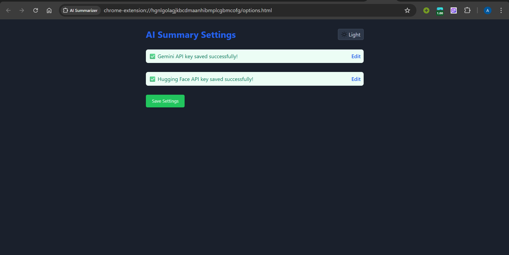

# 🧠 AI Summarizer Chrome Extension

A lightweight and powerful Chrome extension that helps you summarize any webpage you're currently on — in three distinct formats:

- ✅ Brief Summary (2-3 lines)

- ✅ Bullet Points (7-8 concise points)

- ✅ Detailed Summary (for deeper understanding)

Built using Gemini and Hugging Face AI models — no need for costly APIs. Just bring your free API keys, and you're ready to go.

## ✨ Features

- 🔍 Summarize any webpage content instantly

- 🎯 Choose from Brief, Bulleted, or Detailed formats

- 💾 Copy summaries to clipboard

- 🌙 Light/Dark Theme toggle

- 🔐 Secure API Key storage (locally via Chrome sync storage)

- 🔄 Easy editing of saved API keys

## 🧭 Browser Compatibility
This Chrome extension works seamlessly on the following Chromium-based browsers:

- ✅ Google Chrome

- ✅ Brave Browser

- ✅ Microsoft Edge

ℹ️ The extension is built using `manifest_version: 3`, ensuring compatibility with modern versions of these browsers. Other Chromium-based browsers may also be supported.

## 🚀 How to Use

## 📽️ Walkthrough Demo

Click below to watch a quick walkthrough of the Chrome extension:

### 1. Clone or Download the Extension

Click the green Code button above → Download ZIP → extract the ZIP on your machine.

Alternatively:

    git clone https://github.com/Ashhar-24/AI-Summarizer.git

### 2. Load the Extension into Chrome

1. Open Google Chrome

2. Visit `chrome://extensions/`

3. Enable Developer Mode (top-right corner)

4. Click Load unpacked

5. Select the folder where this extension was extracted or cloned

6. Done! ✅ The extension icon will appear in the toolbar (pin it!)

### 3. Setup API Keys

1. By default, the options page will be loaded (or) click the extension icon → go to Settings (⚙️)

2. Enter your free API keys:

    - Gemini API Key:  [Get it here](https://aistudio.google.com/app/apikey)

    - Hugging Face API Key: [Get it here](https://huggingface.co/settings/token)

3. Save the keys

### 4. Start Summarizing

1. Open any webpage

2. Click the extension icon

3. Select the summary type you want (Brief / Bullet / Detailed)

4. Wait a few seconds while the AI fetches your summary

5. Click Copy to copy it to your clipboard

## 🧠 Under the Hood

The extension offers two backend AI summarization engines that the user can choose from:

1. 🔹 Gemini (Google AI)

    - If the user opts for Gemini, the extension sends the raw page content (up to a certain max limit) directly to the Gemini API, using the type of summary the user selected (brief, detailed, or bullet).

    - Gemini’s response is then displayed in the popup interface.

2. 🔸 Hugging Face (Open Source AI)

    - For Hugging Face-based summarization, the extension selects from pre-trained models depending on the user’s chosen format:

        - brief ➜ uses sshleifer/distilbart-xsum-12-6 — optimized for short, concise summaries.

        - detailed ➜ uses sshleifer/distilbart-cnn-12-6 — well-suited for longer, more elaborate summaries.

        - bullets ➜ also uses sshleifer/distilbart-cnn-12-6, but applies a custom formatting logic to split the content into 7–8 bullet points.

    - These models are accessed via Hugging Face’s Inference API, requiring only an API key from the user.

All summarization is done securely via HTTPS APIs, and no content is stored or tracked. The extension is designed to be lightweight, fast, and completely under your control.

## 🛠 Tech Stack

- JavaScript

- TailwindCSS

- Google Gemini API

- Hugging Face Inference API

## 💡 Screenshots

## 📢 Note

This extension is not published on the Chrome Web Store yet. You can still use it easily by following the steps above.

## 🤝 Contributing

Pull requests and suggestions are welcome! Feel free to fork the repo and make your improvements.
